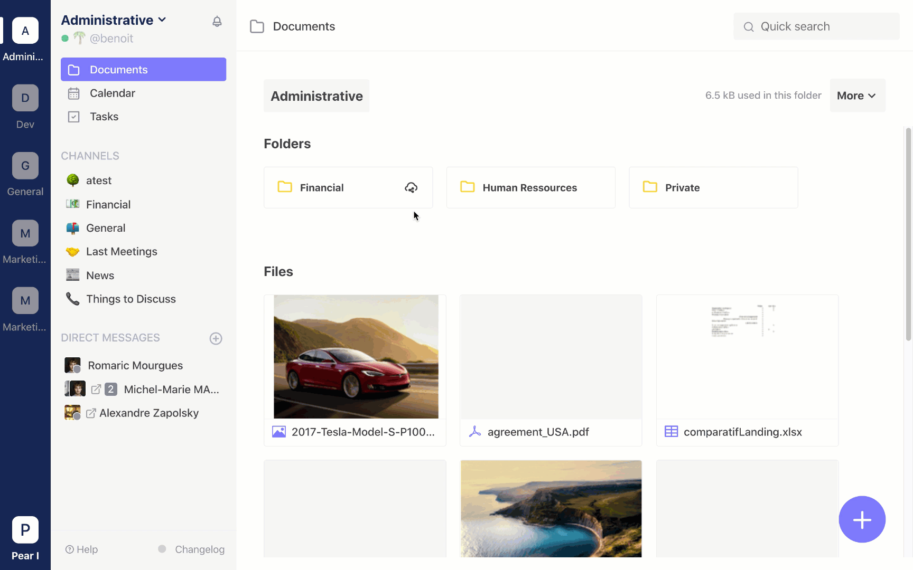

# Share file with public link

In Twake, you can share your folders or files to external user. You juste have to create a public link on what you want to share and send the link. Your partner will access to these elements without creating a Twake account.

### Create a public link

Click on "public access" of what you want to share and "create an access link".

###

### Remove a public link

If you want to remove the public link, select folder you want to unlink, then, "Public access" and "Suppress the link"

