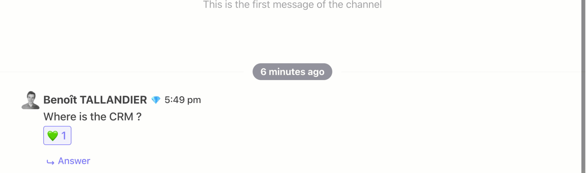

# Message

## Send a message

To send a message, select the channel where you want to post. In the input message, write what you want to send. Press `enter` to send the message.

If you want to add a new line to your message, press `Shift + Enter`.

#### Pin

If one of the message is important for the team, you can pin it \(or unpin\)

#### Reaction

You can react to a message with emoji. Click on the `Emoji button` in message to show emoji picker.

### Response to a message

Someone ask you a question ? You can answer it by clicking `Answer` below the message.

### Reorganize your chat

You can reorganize your chat by dragging and dropping your messages.

###

### See thread message

You can see a thread in a specific view. Hover over in one, the button `Show on the right` . A side panel opens.

## Integration

### Gif

You can send gif in your channel. Just clic gif icon to open a gif selector.

.gif>)

### Call

If you need to call your team, there is native integration with Jitsi. Just click on the green button with the phone and a menu opens on the left to create a Jitsi call. Once the information is filled in, the call link is sent to your team.

## Send document

If you want to send a document through the chat, drag it from your computer and drop it into the chat. It will be uploaded and shared with your teammates.

You can also send a document from Twake drive: click on the `+` button, to the left of the input. You can select a file from Twake and share it in the chat room.
