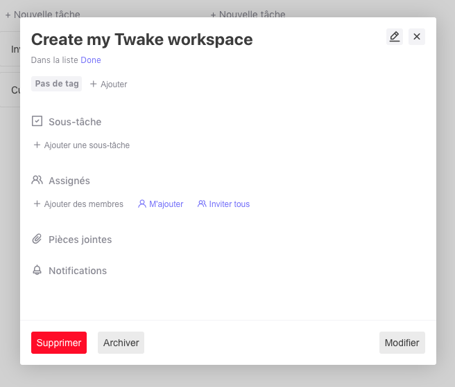

# ObjectModal

#### Usage

```jsx
import ObjectModal from "components/ObjectModal/ObjectModal.js";
```

```jsx
<ObjectModal
  title={<ObjectModalTitle>My awesome title !</ObjectModalTitle>}
  onClose={() => myComponent.closeSomething()}
  disabled
  footer={<Button>Definitly not usefull</Button>}
>
  <FirstChild />
  <span>Some text</span>
</ObjectModal>
```

####

#### Props

| **name**     | **Description**                                                | **Type**  | **Default** |
| ------------ | -------------------------------------------------------------- | --------- | ----------- |
| **disabled** | Disable scrollbar X axis (need to rename for a better clarity) | Boolean   | false       |
| **footer**   | Define a footer component                                      | ReactNode | null        |
| **onClose**  | Add close icon in the component, waiting for a function        | Function  | null        |
| **title**    | _Define a title component_                                     | ReactNode | null        |

####

#### Preview



---
