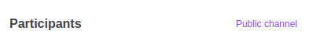

# ObjectModalSectionTitle

#### Usage

```jsx
import ObjectModalFormTitle from "components/ObjectModal/ObjectModal.js";
```

```jsx
<ObjectModalFormTitle name={"Awesome Title!"} />
```

####

#### Props

| **name**      | **Description**                      | **Type** | **Default** |
| ------------- | ------------------------------------ | -------- | ----------- |
| **className** | Use predefined classes for the title | string   | null        |
| **icon**      | Define icon for the title            | string   | null        |
| **name**      | Define the title name                | string   | null        |
| **style**     | Define a custom style for the title  | object   | null        |

####

#### Preview



---
